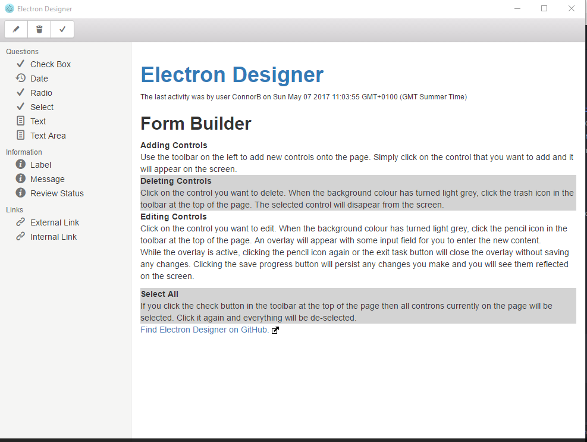
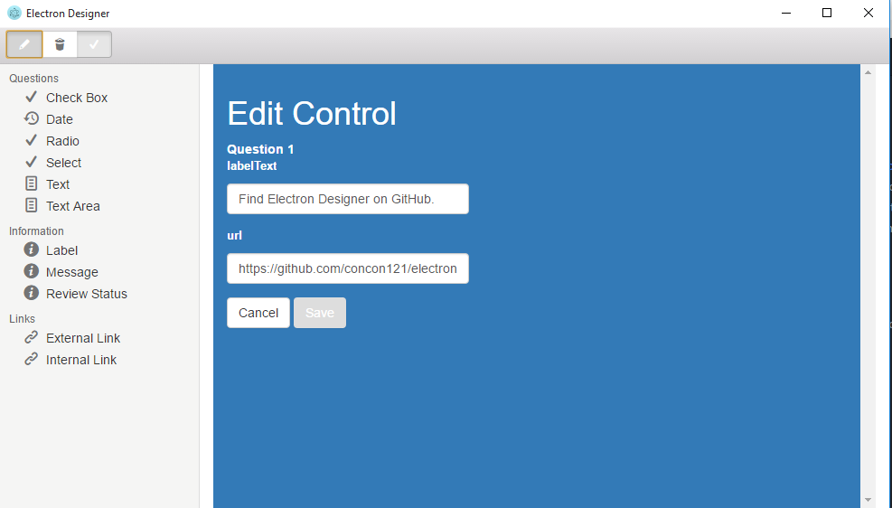

# electron-designer

Electron Designer is a simple demo [Electron](https://electron.atom.io/) application which allows you to build up a web page based on a limited set of [Mustache.js](https://github.com/janl/mustache.js) templates, acting as a means to view different combinations of your partial templates while you develop them.

## Prerequisites
Please ensure that you have these installed on your system before you begin.
-   nodejs

## Starting Up

Install the project dependencies:
```
npm install -g jsttojs
npm install
```

Start the application:
```
npm start
```

Pre-compile mustache templates:
```
jsttojs . views/compiled_views.js --ext mustache
```
You can add the ```--watch``` flag to the jsttojs command to constantly compile the templates as you change them.

## Usage

### The Template Toolbar

The template toolbar provides an ordered and categorised list of all the available templates that you can view.


Clicking any of the options in the template toolbar will put the default template for that option on the screen, ready for you to start editing.

The template toolbar goes down the left hand side of the screen.

### The Action Toolbar

The action toolbar gives you the ability to interact with the controls and form elements that you put on the screen.


From left to right:

*   **Edit** - Click on the control you want to edit.  When the background colour has turned light grey, click the pencil icon in the toolbar at the top of the page.  An overlay will appear with some input field for you to enter the new content.  While the overlay is active, clicking the pencil icon again or the exit task button will close the overlay without saving any changes.  Clicking the save progress button will persist any changes you make and you will see them reflected on the screen.
*   **Delete** - Click on the control you want to delete.  When the background colour has turned light grey, click the trash icon in the toolbar at the top of the page.  The selected control will disappear from the screen.
*   **Select All** - If you click the check button in the action toolbar at the top of the page then all controls currently on the page will be selected.  Click it again and everything will be de-selected.

The action toolbar goes along the top of the screen.

### Misc

#### Selecting Controls



#### Select All


#### Editing Controls


